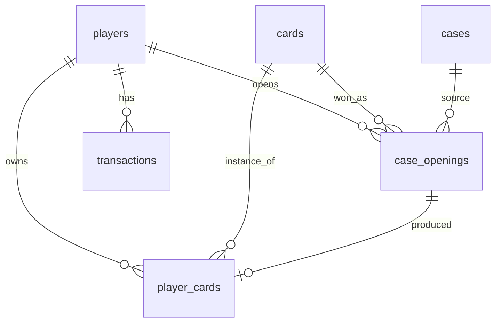

# Модель даних

Назад до [[00 - Card Game MOC]]

## Postgres для всього. Mongo не потрібна.

Ти питав «postgres чи mongo, що доцільніше». Відповідь однозначна — Postgres,
і ось конкретні причини:

1. **Відкриття кейсу — це транзакція.** Списати ключ і видати картку треба
   атомарно. У Mongo це або single-document trick, або multi-doc транзакції,
   які там є, але це боротьба з інструментом.
2. **Дані реляційні.** `player → player_cards → cards` — це два JOIN'и.
   У Mongo це або дублювання даних картки в кожен інвентар (і біль при
   оновленні), або ручний `$lookup`, який і є JOIN, тільки гірший.
3. **Напівструктуровані метадані генерації** (seed, sampler, scheduler,
   lora-и) чудово лягають у `jsonb`-колонку. Ти отримуєш гнучкість Mongo
   там, де вона реально потрібна, не втрачаючи решти.

Єдиний сценарій, де Mongo виграла б — якби схема картки постійно змінювалась
і не було транзакцій. Тут не той випадок.

## Схема

### `cards` — каталог згенерованих карток

| Колонка | Тип | Нотатка |
|---|---|---|
| `id` | uuid PK | |
| `slug` | text UNIQUE | `ember-drake-a3f1` |
| `name` | text | «Ember Drake» — пишеться людиною або LLM, не SD |
| `flavor_text` | text NULL | курсивний рядок унизу картки |
| `rarity` | enum | див. [[05 - Game Design - Rarity & Drop Rates]] |
| `element` | enum NULL | fire/water/earth/air/shadow/light |
| `archetype` | enum | beast / humanoid / undead / construct / spirit |
| `attack` | int | |
| `defense` | int | |
| `image_path` | text | `cards/ember-drake-a3f1.png` — відносний! |
| `thumb_path` | text | `thumbs/ember-drake-a3f1.webp` |
| `status` | enum | `draft` / `approved` / `rejected` |
| `set_id` | uuid NULL | тематичний сет, поки не використовується — див. Q9 в [[11 - Planning - Open Questions]] |
| `gen_meta` | jsonb | усе про генерацію, див. нижче |
| `created_at` | timestamptz | |

`set_id` додається одразу в першій міграції, хоч і лишається NULL. Додати
nullable-колонку зараз — безкоштовно; мігрувати таблицю з 300 картками
пізніше — ні.

**`image_path` відносний, не абсолютний і не повний URL.** Базовий URL
підставляє API з конфігу. Це і є той самий адаптер, який колись стане S3.

**Тільки `status = 'approved'` потрапляє в рулетку.** SD 1.5 видає ~40–60%
придатних артів — крок ручного review обов'язковий, не пропускай його.

`gen_meta` приклад:
```json
{
  "model": "Lykon/dreamshaper-8",
  "prompt": "fantasy trading card art, ember drake, ...",
  "negative_prompt": "text, watermark, blurry, extra limbs, ...",
  "seed": 284719332,
  "steps": 28,
  "cfg_scale": 7.0,
  "sampler": "DPMSolverMultistep",
  "width": 512,
  "height": 512,
  "recipe_id": "beast_fire_epic",
  "generated_at": "2026-07-25T10:12:00Z"
}
```

Індекси: `(status, rarity)` — основний запит для стрічки рулетки.

### `players`

| Колонка | Тип |
|---|---|
| `id` | uuid PK |
| `display_name` | text |
| `balance_coins` | bigint DEFAULT 1000 |
| `balance_keys` | int DEFAULT 5 |
| `created_at` | timestamptz |

Один локальний гравець на старті. Таблиця все одно потрібна — щоб не
розмазувати баланс по конфігах, і щоб мультиюзер потім був не переписуванням,
а просто новим рядком.

### `cases`

| Колонка | Тип | Нотатка |
|---|---|---|
| `id` | uuid PK |
| `slug` | text UNIQUE | `starter-chest` |
| `name` | text |
| `price_coins` | bigint NULL |
| `price_keys` | int NULL | кейс коштує АБО монети, АБО ключ |
| `image_path` | text |
| `rarity_weights` | jsonb | `{"common": 60, "rare": 12, ...}` |
| `is_active` | bool |

Ваги в jsonb, а не окремою таблицею — це конфіг, який змінюється рідко
і завжди читається цілком.

### `player_cards` — інвентар

| Колонка | Тип |
|---|---|
| `id` | uuid PK |
| `player_id` | uuid FK → players |
| `card_id` | uuid FK → cards |
| `drop_id` | uuid FK → case_openings NULL |
| `acquired_at` | timestamptz |
| `sold_at` | timestamptz NULL |

**Один рядок = один екземпляр картки.** Дублікати дозволені й це фіча —
вони є паливом економіки (продаються за монети). Не роби UNIQUE(player, card)
і не роби колонку `quantity` — окремі рядки дають історію і легкий продаж
конкретного екземпляра.

Індекс: `(player_id, sold_at)` — запит інвентаря.

### `case_openings` — історія дропів

| Колонка | Тип | Нотатка |
|---|---|---|
| `id` | uuid PK |
| `player_id` | uuid FK |
| `case_id` | uuid FK |
| `won_card_id` | uuid FK → cards |
| `reel` | jsonb | масив id карток стрічки |
| `winning_index` | int | позиція переможця у стрічці |
| `server_seed` | text | для provably-fair, стретч |
| `client_seed` | text NULL |
| `nonce` | bigint |
| `created_at` | timestamptz |

Зберігати всю стрічку може здатись надлишковим — але це дає можливість
**переграти анімацію** (наприклад, кнопка «replay» в історії) і робить
дебаг RNG тривіальним.

### `transactions` — ledger

| Колонка | Тип |
|---|---|
| `id` | uuid PK |
| `player_id` | uuid FK |
| `type` | enum: `case_open` / `card_sell` / `daily_bonus` / `initial_grant` |
| `delta_coins` | bigint |
| `delta_keys` | int |
| `ref_type` | text NULL |
| `ref_id` | uuid NULL |
| `created_at` | timestamptz |

**Чому ledger, а не просто UPDATE балансу.** Баланс стає перевірюваним:
`SUM(delta_coins) == players.balance_coins` — це інваріант, який ловить
будь-який баг економіки одним запитом. Коштує одну таблицю, економить дні
дебагу «а куди поділись монети». Це стандартна практика і в реальному
iGaming, і в фінтесі.

`players.balance_*` лишається як денормалізований кеш для швидкого читання.

## ER-діаграма



## Міграції

TypeORM migrations, `synchronize: false` навіть локально. Так, це «зайвий
крок для лайт-проекту» — але коли через тиждень захочеш додати колонку до
таблиці з 300 згенерованими картками, дропати базу буде боляче.

## Що НЕ треба зберігати в базі

- Самі PNG (bytea) — файли лежать на диску, у базі тільки шлях
- Стрічку рулетки як окремі рядки — jsonb достатньо
- Ваги дропу per-card — рідкість картки і ваги кейсу дають усе потрібне
