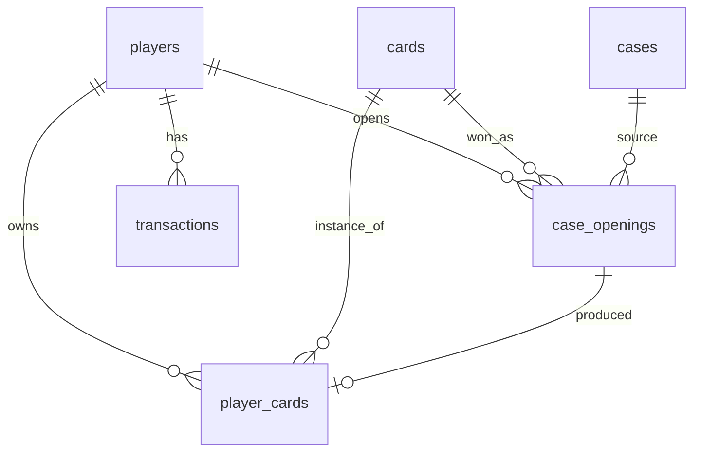

# Data Model

Back to [[00 - Card Game MOC]]

## Postgres for Everything. Mongo Is Not Needed.

You asked “postgres or mongo, which is more appropriate.” The answer is unequivocal — Postgres,
and here are the specific reasons:

1. **Opening a case is a transaction.** Debiting a key and issuing a card must be
   atomic. In Mongo this is either a single-document trick or multi-document transactions,
   which it supports, but that means fighting the tool.
2. **The data is relational.** `player → player_cards → cards` is two JOINs.
   In Mongo this is either duplicating card data in every inventory (and suffering when
   updating it), or using a manual `$lookup`, which is a JOIN, only worse.
3. **Semi-structured generation metadata** (seed, sampler, scheduler,
   LoRAs) fit perfectly in a `jsonb` column. You get Mongo’s flexibility
   where it is actually needed without giving up the rest.

The only scenario where Mongo would win is if the card schema changed constantly
and there were no transactions. This is not that case.

## Schema

### `cards` — generated card catalog

| Column | Type | Note |
|---|---|---|
| `id` | uuid PK | |
| `slug` | text UNIQUE | `ember-drake-a3f1` |
| `name` | text | “Ember Drake” — written by a person or LLM, not SD |
| `flavor_text` | text NULL | italic line at the bottom of the card |
| `rarity` | enum | see [[05 - Game Design - Rarity & Drop Rates]] |
| `element` | enum NULL | fire/water/earth/air/shadow/light |
| `archetype` | enum | beast / humanoid / undead / construct / spirit |
| `attack` | int | |
| `defense` | int | |
| `image_path` | text | `cards/ember-drake-a3f1.png` — relative! |
| `thumb_path` | text | `thumbs/ember-drake-a3f1.webp` |
| `status` | enum | `draft` / `approved` / `rejected` |
| `set_id` | uuid NULL | themed set, not used yet — see Q9 in [[11 - Planning - Open Questions]] |
| `gen_meta` | jsonb | everything about generation, see below |
| `created_at` | timestamptz | |

`set_id` is added in the first migration even though it remains NULL. Adding
a nullable column now is free; migrating a table with 300 cards later is not.

**`image_path` is relative, not absolute and not a full URL.** The API
inserts the base URL from config. This is the same adapter that can later become S3.

**Only `status = 'approved'` enters the roulette.** SD 1.5 produces ~40–60%
usable art; the manual review step is mandatory, so do not skip it.

`gen_meta` example:
```json
{
  "model": "Lykon/dreamshaper-8",
  "prompt": "fantasy trading card art, ember drake, ...",
  "negative_prompt": "text, watermark, blurry, extra limbs, ...",
  "seed": 284719332,
  "steps": 28,
  "cfg_scale": 7.0,
  "sampler": "DPMSolverMultistep",
  "width": 512,
  "height": 512,
  "recipe_id": "beast_fire_epic",
  "generated_at": "2026-07-25T10:12:00Z"
}
```

Indexes: `(status, rarity)` — the primary query for the roulette reel.

### `players`

| Column | Type |
|---|---|
| `id` | uuid PK |
| `display_name` | text |
| `balance_coins` | bigint DEFAULT 1000 |
| `balance_keys` | int DEFAULT 5 |
| `created_at` | timestamptz |

One local player at first. The table is still needed so the balance is not
spread across configs, and so multi-user support later is a new row rather than a rewrite.

### `cases`

| Column | Type | Note |
|---|---|---|
| `id` | uuid PK |
| `slug` | text UNIQUE | `starter-chest` |
| `name` | text |
| `price_coins` | bigint NULL |
| `price_keys` | int NULL | the case costs EITHER coins OR keys |
| `image_path` | text |
| `rarity_weights` | jsonb | `{"common": 60, "rare": 12, ...}` |
| `is_active` | bool |

Weights are in jsonb rather than a separate table; this is config that changes rarely
and is always read in full.

### `player_cards` — inventory

| Column | Type |
|---|---|
| `id` | uuid PK |
| `player_id` | uuid FK → players |
| `card_id` | uuid FK → cards |
| `drop_id` | uuid FK → case_openings NULL |
| `acquired_at` | timestamptz |
| `sold_at` | timestamptz NULL |

**One row = one card instance.** Duplicates are allowed and are a feature —
they fuel the economy (they are sold for coins). Do not make UNIQUE(player, card)
and do not add a `quantity` column; separate rows provide history and make selling
a specific instance easy.

Index: `(player_id, sold_at)` — inventory query.

### `case_openings` — drop history

| Column | Type | Note |
|---|---|---|
| `id` | uuid PK |
| `player_id` | uuid FK |
| `case_id` | uuid FK |
| `won_card_id` | uuid FK → cards |
| `reel` | jsonb | array of card IDs in the reel |
| `winning_index` | int | winner’s position in the reel |
| `server_seed` | text | for provably fair, stretch |
| `client_seed` | text NULL |
| `nonce` | bigint |
| `created_at` | timestamptz |

Storing the entire reel may seem excessive, but it makes it possible to
**replay the animation** (for example, a “replay” button in history) and makes
RNG debugging trivial.

### `transactions` — ledger

| Column | Type |
|---|---|
| `id` | uuid PK |
| `player_id` | uuid FK |
| `type` | enum: `case_open` / `card_sell` / `daily_bonus` / `initial_grant` |
| `delta_coins` | bigint |
| `delta_keys` | int |
| `ref_type` | text NULL |
| `ref_id` | uuid NULL |
| `created_at` | timestamptz |

**Why a ledger instead of simply UPDATEing the balance.** The balance becomes verifiable:
`SUM(delta_coins) == players.balance_coins` — this invariant catches
any economy bug with one query. It costs one table and saves days of
debugging “where did the coins go?” This is standard practice both in real
iGaming and in fintech.

`players.balance_*` remains as a denormalized cache for fast reads.

## ER Diagram



## Migrations

TypeORM migrations, `synchronize: false` even locally. Yes, this is an “extra
step for a lightweight project,” but when you want to add a column to a table
with 300 generated cards a week later, dropping the database will hurt.

## What NOT to Store in the Database

- The PNGs themselves (bytea) — files live on disk; only the path is in the database
- The roulette reel as separate rows — jsonb is sufficient
- Per-card drop weights — card rarity and case weights provide everything needed
